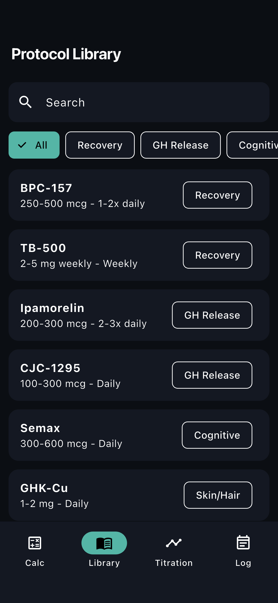
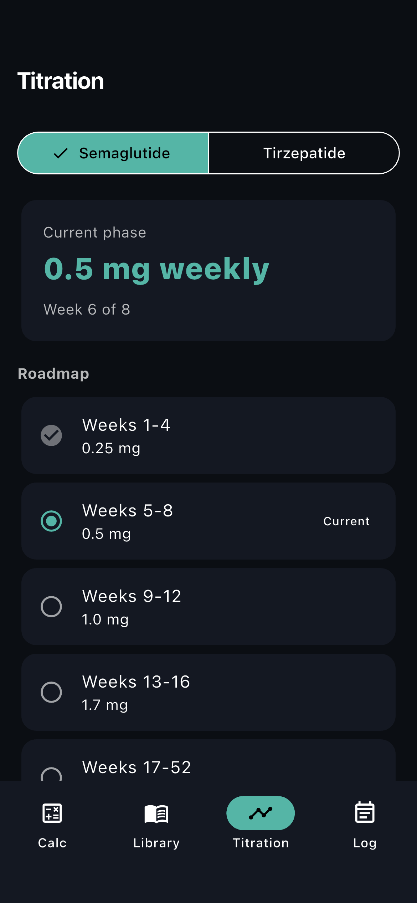
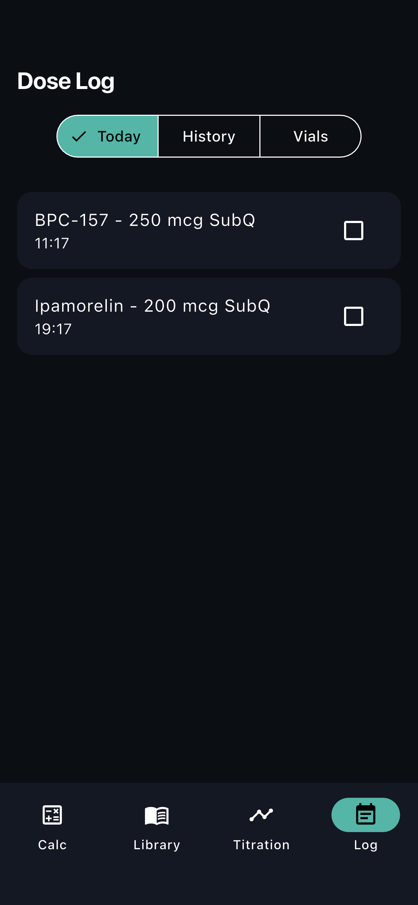
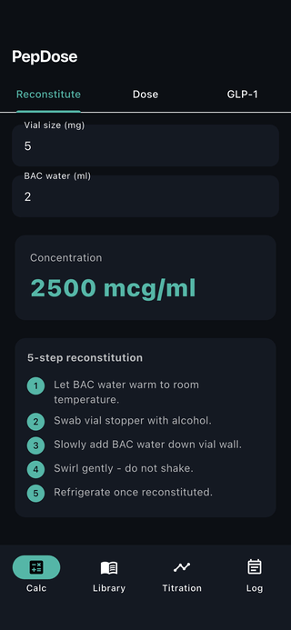

# flutter-glp1-tracker

Flutter POC for a peptide and GLP-1 companion app (PepDose-style). Reconstitution calculator, GLP-1 dose calculator, protocol library, titration roadmap, and dose log.

## Demo

Real captures from the running app on the iOS Simulator (see [FLOW.md](FLOW.md) for how they were generated).

| Reconstitution calculator | Protocol library | Titration roadmap | Dose log |
| --- | --- | --- | --- |
|  |  |  |  |



## Features

- **Reconstitution calculator**: vial size (mg) + BAC water (ml) -> concentration (mcg/ml)
- **Dose calculator**: concentration + desired dose + syringe type (U-100/U-50) -> ml + syringe units
- **GLP-1 calculator**: vial concentration + weekly dose -> insulin syringe units with plain-English instruction
- **Protocol library**: searchable, category filtered (Recovery, GH Release, Cognitive, Skin/Hair, Longevity, Fat Loss, Sleep, Sexual Health, Immune, GLP-1) with 13+ entries including Semaglutide, Tirzepatide, Retatrutide
- **Titration tracker**: Semaglutide and Tirzepatide roadmaps with current-phase detection
- **Dose log**: Today / History / Vials views with completion state and low-stock alerts

## Stack

Flutter 3.x, Riverpod, Material 3 dark theme. Pure Dart calculator logic unit-testable.

## Run

```
flutter pub get
flutter run
```

## Disclaimer

For research and educational purposes only - not medical advice.
